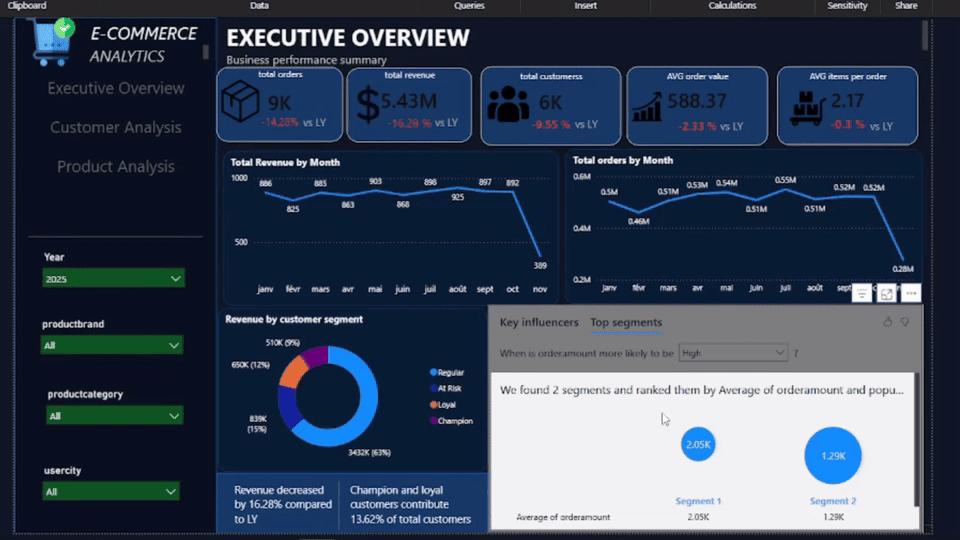
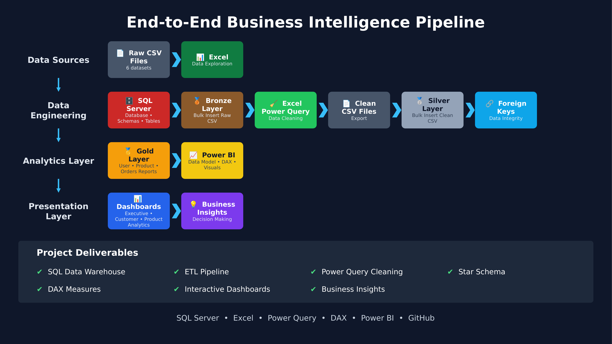
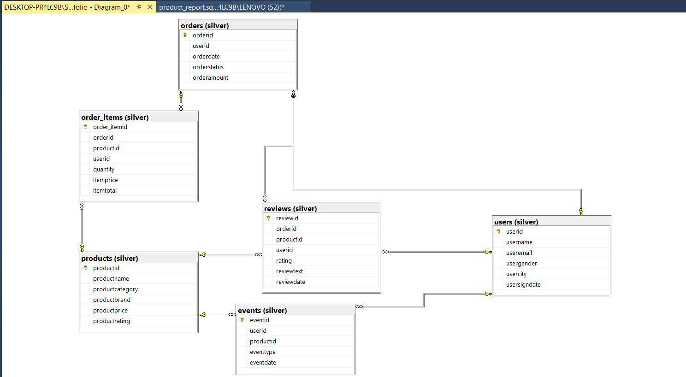
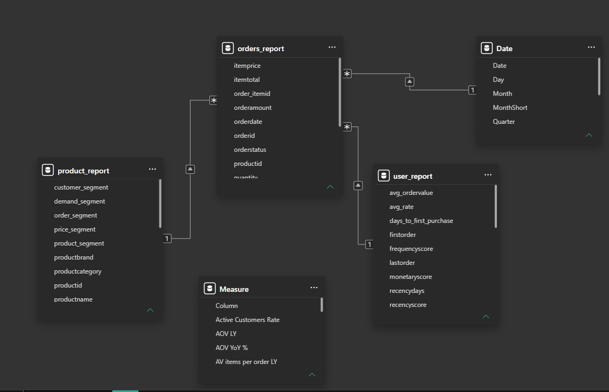
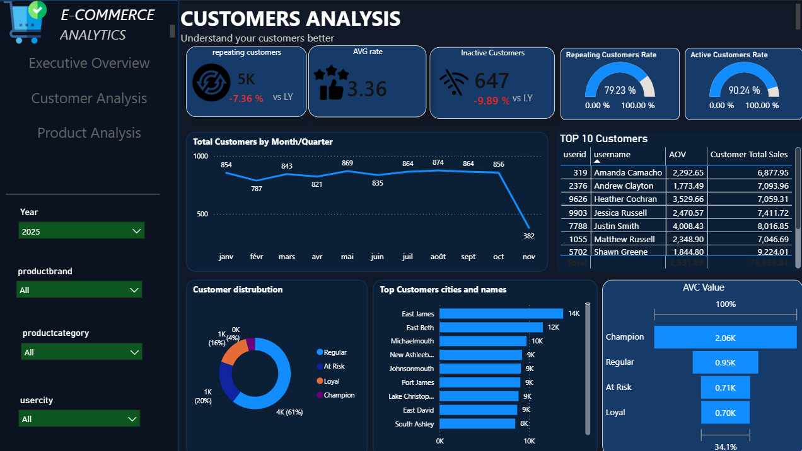
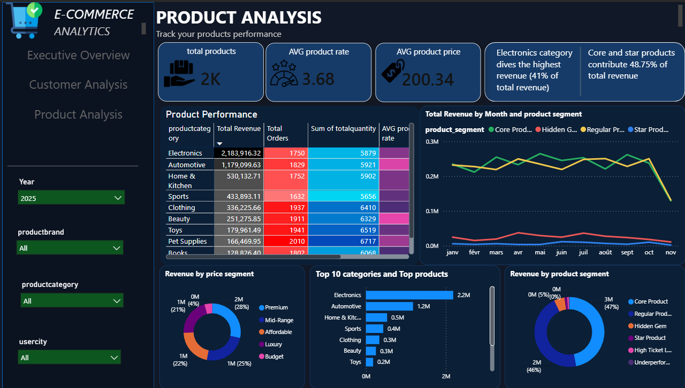

# End-to-End E-Commerce Business Intelligence Project

Turning six raw data files into a decision-ready reporting system, from SQL Server to Power BI.

## Overview

Most companies don't struggle with a lack of data — they struggle with data that lives in six different places and answers no question on its own. This project takes that exact situation and solves it end to end, turning six raw CSV files into a SQL Server data warehouse (Bronze, Silver, Gold), a clean relational model, and three interactive Power BI dashboards driven by custom DAX measures.

The dataset is synthetic, used purely for learning and portfolio purposes — but it was treated the way a real production dataset would be. Nothing was loaded directly into Power BI; every table passed through the same pipeline real company data would go through first.

## Dataset Statistics

| | |
|---|---|
| Raw Source Files | 6 |
| Total Records | ~190,000 |
| SQL Scripts | 7 |
| Gold Layer Reports | 3 |
| Interactive Dashboards | 3 |
| Foreign Key Relationships | 8 |

## Architecture



The project follows a layered Business Intelligence architecture, commonly known as the Medallion architecture. Raw files land untouched in the Bronze layer, get cleaned and validated on their way into the Silver layer, and are reshaped into three business-ready reporting tables in the Gold layer before reaching Power BI.

## The Business Problem

An e-commerce business running on six disconnected CSV exports has no single place to answer basic questions: which customers are worth protecting, which products are actually profitable, and whether this month is doing better or worse than last year. The data existed, but it wasn't structured or trustworthy enough to build decisions on.

The goal was to design a reporting system a real analytics team could stand behind — not a one-off dashboard, but a maintained data warehouse underneath it.

## The Solution

The response was a full data warehouse built in SQL Server, following the Bronze → Silver → Gold pattern. Excel Power Query handled the cleaning stage, keeping every transformation transparent and reproducible. On top of the resulting relational model, Power BI hosts three dashboards driven by DAX measures, including RFM-based customer segmentation and a multi-factor product classification system.

## Project Highlights

- Implemented a complete Medallion Architecture (Bronze, Silver, Gold) end to end.
- Built a three-layer SQL Server data warehouse (Bronze → Silver → Gold) across six source tables.
- Cleaned and standardized all data using Excel Power Query before reloading it into SQL Server.
- Designed a fully relational Silver-layer schema with primary keys and eight foreign key relationships.
- Engineered three Gold-layer reporting tables with RFM scoring, customer segmentation, and multi-dimensional product classification.
- Delivered three interactive Power BI dashboards with custom DAX measures and an AI-powered key-influencers panel.

## Tech Stack

| Tool | Role |
|---|---|
| SQL Server | Data warehouse (Bronze, Silver, Gold layers) |
| Excel & Power Query | Data cleaning and transformation |
| Power BI | Data modeling and dashboards |
| DAX | Business metrics and calculated measures |
| GitHub | Version control and documentation |

## Data Warehouse Design



The Silver layer holds six related tables — users, orders, order items, products, reviews, and events — connected through eight foreign key relationships that enforce referential integrity across the model.

The Gold layer doesn't expose these transactional tables directly to Power BI. Instead, it pre-aggregates everything into three purpose-built reporting tables: a User Report with RFM scores and customer segments (Champion, Loyal, Regular, At Risk, New, Lost), a Product Report with pricing, demand, and strategic classifications (Star Product, Core Product, Hidden Gem, Underperformer, and more), and an Orders Report that merges orders and order items into a single fact table.

## Power BI Data Model



Power BI connects to the three Gold reporting tables plus a date dimension and a dedicated measures table, kept intentionally simple so DAX calculations stay fast and easy to maintain rather than relying on heavy joins inside the model.

## Dashboards

### Executive Overview


A summary view for decision-makers: total orders, revenue, customers, average order value, and items per order, each compared against last year. Below the KPIs, monthly revenue and order trends sit next to a breakdown of revenue by customer segment, along with an AI-powered key-influencers panel that explains what's actually driving changes in order value.

### Customer Analysis



A closer look at customer behavior: repeat purchase rate, inactive customers, and active customer rate, alongside a monthly customer trend and a segment-based distribution (Champion, Loyal, Regular, At Risk). A top-10 customers table and an average customer value comparison across segments round out the page.

### Product Analysis



A category-by-category performance view, from total revenue and average rating down to a full product performance table by category. Revenue is broken down by price tier and by strategic product segment, making it easy to spot which categories — and which specific products — are actually driving the business.

## Business Insights

The dashboards help decision-makers answer questions such as:

- Which customer segments are the most valuable, and which are at risk of churn?
- Which product categories and segments generate the most revenue?
- How did revenue and order volume move compared to last year, and why?
- Which products are high-potential "hidden gems" versus underperformers?

In this dataset, for example, Electronics alone accounts for 41% of total revenue, while Champion and Loyal customers — just 13.6% of the customer base — make up a disproportionate share of repeat business.

## Repository Structure

```
E-Commerce-End-to-End-Business-Intelligence-Project
│
├── architecture
│     architecture-diagram.pdf
│     architecture-diagram.png
│
├── datasets
│     ├── raw
│     └── cleaned
│
├── docs
│
├── excel
│     Data Cleaning.xlsx
│
├── images
│     Executive_overview.png
│     customer_dashboard.png
│     Product_dashboard.png
│     modeling.png
│     diagram.png
│
├── powerbi
│     Ecommerce Analytics.pbix
│
└── sql
      01_database_creation.sql
      02_bronze_bulk_insert.sql
      03_silver_bulk_insert.sql
      04_foreign_keys.sql
      05_gold_users.sql
      06_gold_products.sql
      07_gold_orders.sql
```

## Future Improvements

- Incremental data refresh instead of a full reload each time.
- Automated, scheduled ETL orchestration.
- Publishing the model to Power BI Service with a refresh schedule.
- Predictive analytics for churn risk and sales forecasting.
